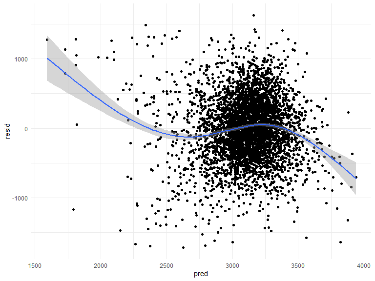
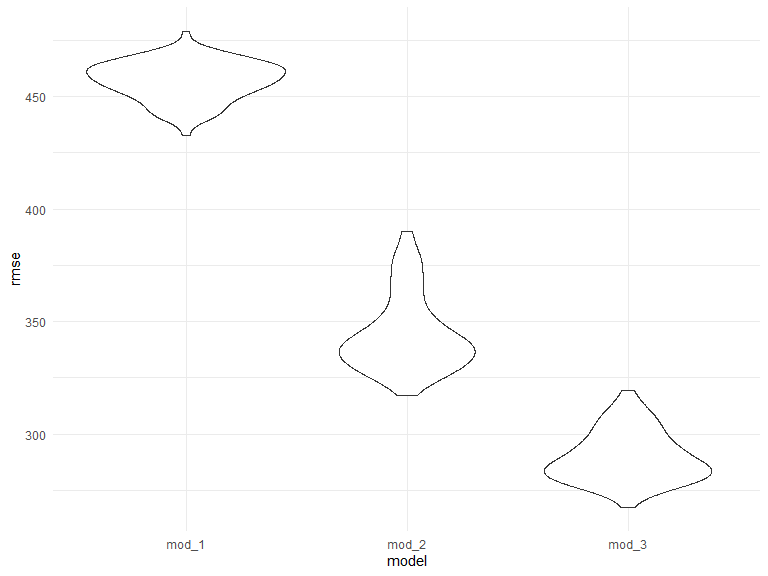
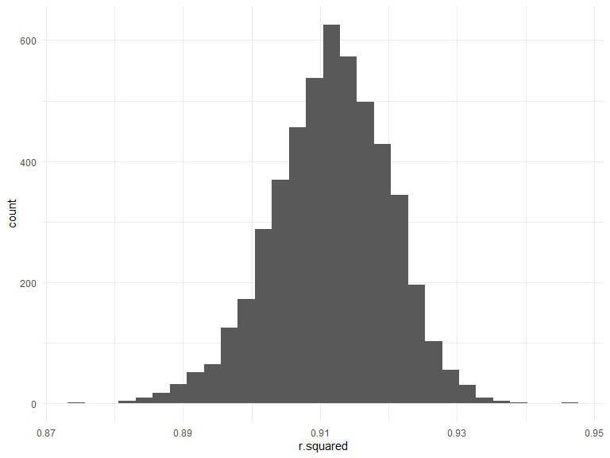
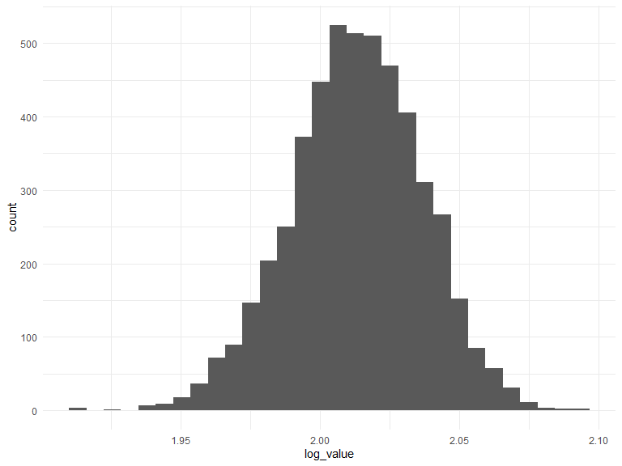

p8105\_hw6\_yz4184
================
Yunlin Zhou
12/4/2021

## Problem 1

### Load and clean the data

``` r
birth_weight_df = read_csv("./birthweight.csv")%>%
  mutate(
    babysex = as.factor(babysex),
    frace = as.factor(frace),
    gaweeks = round(gaweeks),
    malform = as.factor(malform),
    mrace = as.factor(mrace),
    ppbmi = round(ppbmi, digits = 3)
  )%>%
  drop_na()
```

    ## Rows: 4342 Columns: 20

    ## -- Column specification --------------------------------------------------------
    ## Delimiter: ","
    ## dbl (20): babysex, bhead, blength, bwt, delwt, fincome, frace, gaweeks, malf...

    ## 
    ## i Use `spec()` to retrieve the full column specification for this data.
    ## i Specify the column types or set `show_col_types = FALSE` to quiet this message.

### Set my own model

I choose the columns including gestational age in weeks, mother’s
height, mother’s pre-pregnancy weight as the factors that might cause
low birth weight. Because early-born babies are more likely to have
low-birth weight, and if the mother is skinny, the baby might teand to
have lower weight.

``` r
fit = lm(bwt ~ gaweeks + mheight + ppwt, data = birth_weight_df)

residual_btw = modelr::add_residuals(birth_weight_df, fit)%>%select(resid)

prediction_btw = modelr::add_predictions(birth_weight_df, fit)%>%select(pred)

res_pred_df = cbind(residual_btw,
                     prediction_btw)
res_pred_df%>%
ggplot(aes(x = pred, y = resid)) +
  geom_point()+
  geom_smooth()
```

    ## `geom_smooth()` using method = 'gam' and formula 'y ~ s(x, bs = "cs")'



The goal of residuals vs predicted values plot is seeing a random
pattern distributed around 0. As shown in the plot, the dots are evenly
distribute around 0 and satisfied the goal.

### 2 other models

``` r
lm(bwt ~ blength + pnumsga, data = birth_weight_df)
```

    ## 
    ## Call:
    ## lm(formula = bwt ~ blength + pnumsga, data = birth_weight_df)
    ## 
    ## Coefficients:
    ## (Intercept)      blength      pnumsga  
    ##     -3841.3        139.8           NA

``` r
lm(bwt ~ bhead * blength + blength * babysex + bhead * babysex + bhead * blength * babysex, data = birth_weight_df)
```

    ## 
    ## Call:
    ## lm(formula = bwt ~ bhead * blength + blength * babysex + bhead * 
    ##     babysex + bhead * blength * babysex, data = birth_weight_df)
    ## 
    ## Coefficients:
    ##            (Intercept)                   bhead                 blength  
    ##             -7176.8170                181.7956                102.1269  
    ##               babysex2           bhead:blength        blength:babysex2  
    ##              6374.8684                 -0.5536               -123.7729  
    ##         bhead:babysex2  bhead:blength:babysex2  
    ##              -198.3932                  3.8781

### Compare 3 models

``` r
cv_df = 
  crossv_mc(birth_weight_df, 100) 

cv_df = 
  cv_df %>% 
  mutate(
    mod_1  = map(train, ~lm(bwt ~ gaweeks + mheight + ppbmi + ppwt, data = .x)),
    mod_2  = map(train, ~lm(bwt ~ blength + pnumsga, data = .x)),
    mod_3  = map(train, ~lm(bwt ~ bhead * blength + blength * babysex + bhead * babysex + bhead * blength * babysex, data = .x))) %>% 
  mutate(
    rmse_mod_1 = map2_dbl(mod_1, test, ~rmse(model = .x, data = .y)),
    rmse_mod_2 = map2_dbl(mod_2 , test, ~rmse(model = .x, data = .y)),
    rmse_mod_3 = map2_dbl(mod_3, test, ~rmse(model = .x, data = .y)))
```

### The distribution of RMSE values for each model

``` r
cv_df %>% 
  select(starts_with("rmse")) %>% 
  pivot_longer(
    everything(),
    names_to = "model", 
    values_to = "rmse",
    names_prefix = "rmse_") %>% 
  mutate(model = fct_inorder(model)) %>% 
  ggplot(aes(x = model, y = rmse)) + geom_violin()
```



As shown in the plot, mod\_3 has the smallest rmse which makes mod\_3
the best model.

## Problem 2

### Load data

``` r
weather_df = 
  rnoaa::meteo_pull_monitors(
    c("USW00094728"),
    var = c("PRCP", "TMIN", "TMAX"), 
    date_min = "2017-01-01",
    date_max = "2017-12-31") %>%
  mutate(
    name = recode(id, USW00094728 = "CentralPark_NY"),
    tmin = tmin / 10,
    tmax = tmax / 10) %>%
  select(name, id, everything())
```

    ## Registered S3 method overwritten by 'hoardr':
    ##   method           from
    ##   print.cache_info httr

    ## using cached file: C:\Users\yunli\AppData\Local/Cache/R/noaa_ghcnd/USW00094728.dly

    ## date created (size, mb): 2021-10-05 10:03:14 (7.617)

    ## file min/max dates: 1869-01-01 / 2021-10-31

### R square

``` r
bootstrap_r = 
  weather_df%>%
  bootstrap(n = 5000, id = "strap_number")%>%
 mutate(
    models =map(.x = strap, ~lm(tmax ~ tmin, data = .x)),
    results = map(models, broom::glance)
    )%>%
  select(strap_number,results)%>%
  unnest(results)

bootstrap_r%>%
  ggplot(aes(x = r.squared))+
  geom_histogram()
```

    ## `stat_bin()` using `bins = 30`. Pick better value with `binwidth`.



``` r
bootstrap_r %>% 
  summarize(
    ci_lower = quantile(r.squared, 0.025), 
    ci_upper = quantile(r.squared, 0.975))
```

    ## # A tibble: 1 x 2
    ##   ci_lower ci_upper
    ##      <dbl>    <dbl>
    ## 1    0.893    0.927

95% confidence interval for R square is from 0.894 to 0.927. The
distribution of R square is approximately a normal distribution and the
mu is around 0.91.

### log\_value

``` r
bootstrap_b = 
  weather_df%>%
  bootstrap(n = 5000, id = "strap_number")%>%
 mutate(
    models =map(.x = strap, ~lm(tmax ~ tmin, data = .x)),
    results = map(models, broom::tidy))%>%
  select(strap_number,results)%>%
  unnest(results)%>%
  select(strap_number, term, estimate)%>%
  pivot_wider(names_from = term,
              values_from = estimate)%>%
 janitor::clean_names()%>%
 mutate(
   log_value = log(intercept * tmin))

bootstrap_b%>%
  ggplot(aes(x = log_value))+
  geom_histogram()
```

    ## `stat_bin()` using `bins = 30`. Pick better value with `binwidth`.



``` r
bootstrap_b %>% 
  summarize(
    ci_lower = quantile(log_value, 0.025), 
    ci_upper = quantile(log_value, 0.975))
```

    ## # A tibble: 1 x 2
    ##   ci_lower ci_upper
    ##      <dbl>    <dbl>
    ## 1     1.96     2.06

95% confidence interval for R square is from 1.96 to 2.06. The
distribution of R square is approximately a normal distribution and the
mu is around 2.
